# Überblick

Zunächst möchte ich klarstellen, daß ich zwar mit einem Lötkolben einigermaßen umgehen kann, aber kein Elektroniker bin, sondern Software-Entwickler. Also keine Angst beim Nachbauen der hier beschriebenen Wetterstation :-)

Nachdem ich einige Erfahrungen mit der Wetterstation auf meinem Haus sammeln konnte, hat sich der Wunsch nach einer Wetterstation auf unserem [Fluggelände](http://www.fg-daidalos.de/index.php/startseite) förmlich aufgedrängt.
Während die Sensoren mit

1. Windgeschwindigkeit
2. Windrichtung
3. Temperatur
4. Luftfeuchtigkeit
5. Luftdruck
6. Niederschlagsmenge
7. Sonneneinstrahlung

... weitgehend identisch sind, bringen zwei Aspekte echte Herausforderungen:

1. Daten-Upload über Mobilfunknetz
2. Solare Stromversorgung

Aufgrund der positiven Erfahrungen mit [Weather Underground](http://www.wunderground.com) (Darstellung der Daten, Historisierung der Daten, Upload-Schnittstelle, Zuverlässigkeit) soll auch bei dieser Wetterstation der Daten-Upload dorthin erfolgen.

Die __aktuellen Werte der Wetterstation__ lassen sich über ein Widget in beliebige Webseiten anzeigen (Werte in Grafik nicht aktuell, sondern nur statische Grafik). Durch einen Klick darauf kommt man direkt auf die WeatherUnderground-Seite mit den Detailinformationen.

[](http://www.wunderground.com/personal-weather-station/dashboard?ID=IHESSENN7)

# Datenupload über Mobilfunknetz

Für die Integration des Arduino in das Mobilfunknetz hat man grundsätzlich die Wahl zwischen GPRS und UMTS. Für beide Mobilfunkstandards werden unterschiedliche Arduino-Shields angeboten. Weil die Wetterstation nur kleine Datenmengen transferiert, ist ein relativ günstiger Shield auf Basis des [SIM900](http://wm.sim.com/producten.aspx?id=1019) ausreichend. Aufgrund der guten Dokumentation habe ich mich für den 
[EFCom GPRS/GSM Shield von ElecFreaks](http://www.elecfreaks.com/wiki/index.php?title=EFCom_GPRS/GSM_Shield) entschieden.

Der GSM-Shield wird mit einer kleinen Stummelantenne geliefert. Weil die Elektronik der Wetterstation in einen kleinen Schaltschrank eingebaut werden soll, ist eine __externe Antenne__ erforderlich. Ich habe mich für eine DeLock-Antenne mit 3 dBi, Magnetfuß und 2m Kabel mit SMA-Konnektor entschieden.

Für den GSM-Shield wird die __Bibliothek__ [GSM-GPRS-GPS-Shield](https://github.com/MarcoMartines/GSM-GPRS-GPS-Shield) benötigt. Ich habe die Version 3.07.1 verwendet.
Dabei hat sich schnell gezeigt, daß der Speicher der Arduinos mit 32K RAM (Uno, Leonardo) damit fast vollständig belegt ist. Also habe ich aus der Bibliothek alle Funktionen entfernt, die nicht für HTTP notwendig sind (SMS, Voice, ...). Außerdem habe ich in GSM.cpp die für TX und RX verwendeten Pins angepaßt - dazu später mehr. Die angepaßte Bibliothek findet sich hier auf [Github](https://github.com/camueller/GSM-GPRS-GPS-Shield).

Natürlich wird für den GSM-Shield eine __SIM-Karte__ benötigt und es stellt sich die Frage nach dem Provider. Die meisten Provider haben nur Tarife mit vielen Flats oder reine Datentarife mit großem Volumen. Für den Upload der Wetterdaten benötigen wir aber nur einen Tarif mit geringem Datenvolumen ohne Telefonie und SMS. Glücklicherweise hat [Congstar](http://www.congstar.de) gerade den Tarif [Prepaid wie ich will](https://www.congstar.de/prepaid/prepaid-karte) eingeführt, bei dem man Datenvolumen, SMS und Telefonie selbst konfigurieren kann. Für die Wetterstation habe ich 100 MB ohne Telefonie und SMS konfiguriert, was im Ergebnis zu einer __Monatsgebühr von 2 Euro__ führt - und das im gut ausgebauten Telekom-Netz!

Ich habe auch Tests im __EPlus__-Netz gemacht, indem statische Daten per HTTP-Post zu Weather Underground hochgeladen werden sollten. Im Gegensatz zum Telekom-Netz kam dabei immer folgende Fehlermeldung:
```
HTTP/1.0 502 Bad Gateway
Cache-Control: no-cache
Connection: close
Content-Type: text/html

<html><body><h1>502 Bad Gateway</h1>
The server returned an invalid or incomplete response.
</body></html>
```

Beim Testen des Daten-Uploads mit dem GSM-Shield ist es wichtig, daß der Arduino durch ein __Netzteil__ mit Strom versorgt wird, weil er während des Sendens mehr Strom benötigt, als die USB-Schnittstelle eines Laptops oder PCs liefern kann. Andernfalls hat man den Eindruck, daß der GSM-Shield nicht funktioniert, tatsächlich liegt es aber an der unzureichenden Stromversorgung. In meinem Fall war ein Netztteil mit 9V und 660 mA ausreichend für die Tests der kompletten Wetterstation.

# Arduino

Für die Wetterstation habe ich einen [Arduino UNO](https://www.arduino.cc/en/Main/ArduinoBoardUno) verwendet. Dieser bietet 2 Interrups - gerade genug, da sowohl der Windgeschwindigkeitssensor als auch der Regenmesser einen Interrupt benötigen.

Die Jumper des EFCom-GSM-Shields lassen nur die Verwendung der Pins D0 bis D3 zu, die aber wegen der Interrupts auf diesen Pins für die Sensoren benötigt werden. Abhilfe ist [hier](https://code.google.com/p/gsm-shield-arduino/issues/detail?id=53) beschrieben: TX mit D10 (weisses Kabel im Bild) und RX mit D11 (braunes Kabel im Bild) verbinden und die Pin-Nummern in _GSM.cpp_ entsprechend ändern:

```
//De-comment this two lines below if you have the
//second version og GSM GPRS Shield
//#define _GSM_TXPIN_ 2
//#define _GSM_RXPIN_ 3 
#define _GSM_TXPIN_ 10
#define _GSM_RXPIN_ 11 
```

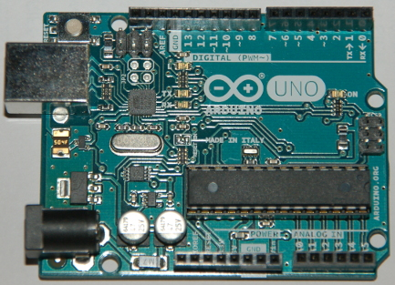

Die Elektronik für die fertige Wetterstation bestehend aus Arduino, dem Shield für Sensorelektronik und dem GSM-Shield ist auf den beiden nachfolgenden Bildern zu sehen.

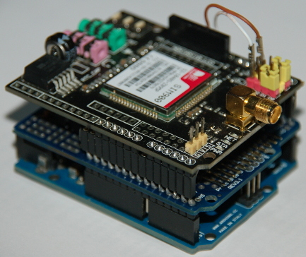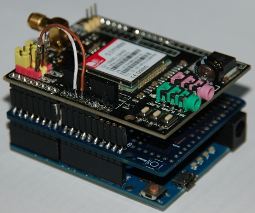

# Sensoren

Theoretisch kann man mechanische Sensonen für Windrichtung, Windgeschwindigkeit und Regenmenge selbst bauen und irgendwie an einem Mast befestigen. Wesentlich leichter ist es, wenn man sich eine __Ersatz Ausseneinheit WH1080__ kauft, die alles beinhaltet, was bei einer [WH1080](http://wiki.wetterstationen.info/index.php?title=WH1080_/_WS1080) außen montiert wird: Mast und Sensoren inklusive Halterungen. Für deren Sensoren für Windrichtung, Windgeschwindigkeit und Regenmenge git es auch [Dokumentation](pics/WeatherSensorAssembly.pdf).


## Windgeschwindigkeitssensor
Allerdings hat sich gezeigt, dass der Windgeschwindigkeitssensor zu geringe Windgeschwindigkeiten misst - ein Problem dass [andere](https://groups.google.com/forum/#!topic/wview/ApDfFduWKn8) auch hatten und gelöst haben, indem sie das minderwertige Original-Kugellager durch ein hochwertiges __Keramik-Kugellager__ ersetzt haben. Das Kugellager muss einen Aussendurchmesser von 10mm und einen Innendurchmesser von 5mm haben. Ich habe ein [Schmuhmacher U2862 Cermaic Bearing 5x10x4 Shielded (pr)](http://www.racing-cars.com/pp/Old_Cars_and_Parts/Fusion_21/U2698.html) verwendet, das eigentlich für Modellrennwagen gedacht ist.

Zunächst dachte ich, daß man von innen an das Kugellager kommt, aber nachdem ich [diese Beschreibung](http://sandaysoft.com/forum/viewtopic.php?f=16&t=2474) gefunden hatte, war klar, dass man das Windrad einfach kräftig abziehen muss. Danach kann man den oben aus dem Kugellager herausragenden Kunststoff abschneiden und das alte Kugellager abziehen. Jetzt kann man das neue Kugellager aufschieben und mit einer kleinen Schraube und nichtrostender Unterlegscheibe sichern. Zum Schluss kann das Windrad wieder aufgesteckt werden. Es dreht jetzt leichter und läuft aufgrund der geringeren Reibung länger nach.

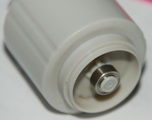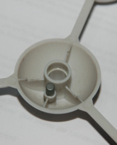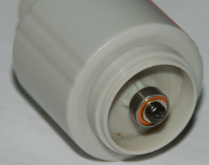

## Temperatur und Luftfeuchtigkeit
Die Elektronik im [Stevenson-Screen](http://de.wikipedia.org/wiki/Thermometerh%C3%BCtte) habe ich komplett entfernt und durch eine Platine mit den von mir gewählten Sensoren ersetzt:
Zur Messung der __Temperatur__ verwende ich einen [Maxim DS18B20](https://datasheets.maximintegrated.com/en/ds/DS18B20.pdf), der günstig ist und durch das 1-Wire-Protokoll digital ausgelesen werden kann.
Bei der Messung der __Luftfeuchtigkeit__ ist es wichtig, einen Sensor zu wählen, der bis zum Taupunk korrekt messen kann, was beim [Honeywell HIH-5031](http://sensing.honeywell.com/index.php?ci_id=49692) der Fall ist.
Sämtliche Kontakte habe ich mit Heisskleber "ummantelt", damit es durch Tauwasser keine ungewollten Verbindungen gibt. Die Öffnung für die Kabelbuchsen habe ich durch ein Stück Plastik vom "geschlachteten" Solar-Aufsatz verschlossen, daß mit Heisskleber abgedichtet wurde.

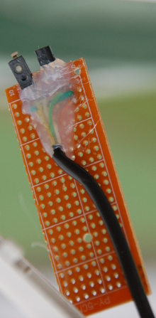

## Luftdruck
Für die Messung des Luftdrucks verwende ich einen [MPL3115A2](http://www.nxp.com/files/sensors/doc/data_sheet/MPL3115A2.pdf), den es auch auf einem [Breakout-Board mit integrierten Pull-Up-Widerständen](http://www.berlinsensorik.de/web/index.php?id=mpl3115a2) gibt. Ursprünglich wollte ich diesen Sensor auch im Stevenson-Screen installieren, aber ich musste feststellen, dass bei Leitungslängen größer 1 Meter das I2C-Protokoll nicht immer funktioniert und der Arduino nicht mit dem Sensor kommunizieren kann. Deshalb ist der Sensor mit einem ca. 50cm lange Kabel mit dem Arduino verbunden. Auch hier habe ich alle Kontakte auf dem Breakout-Board mit Heisskleber ummantelt.

## Sonneneinstrahlung
Bis vor kurzem wußte ich nicht, daß ein Meßgerät zum Messen der __Sonneneinstrahlung__ [Pyranometer](http://de.wikipedia.org/wiki/Pyranometer) genannt wird. Die Messung dieser Größe hat mir die meisten Kopfzerbrechen bereitet. Da es mir nicht um eine theoretische Abhandlung des Themas geht und kommerzielle Meßgeräte schnelle vierstellige Euro-Beträge kosten, habe ich gezielt nach Do-It-Yourself-Lösungen zu diesem Thema gesucht. Zwei Ansätze habe ich dabei gefunden: Solarzelle und Photo-Dioden. Beide sind abhängig vom Einfallwinkel der Sonnenstrahlung, d.h. man muß den Sensor entweder dem Sonnenlauf nachführen oder mehrere Sensoren verwenden. Nachdem ich [diesen Bericht](http://www.icrepq.com/icrepq'10/598-Laghrouche.pdf) zu dem Thema gelesen hatte, entschied ich mich für die sehr kostengünstige Lösung mit __8 Photo-Dioden BPW34__ (10 Stück kosten ca. 5 Euro), deren Strom ziemlich linear zur Lichteinstrahlung verläuft. Diese sind auf einem __Alu-Flachband__ angebracht, das __kreisförmig__ gebogen ist und gegen die Horizontale geneigt ist. Die Neigung soll der Neigung der __Sonnenlaufbahn__ entsprechen, die man sich für einige deutsche Städte [hier](http://cgi.stadtklima-stuttgart.de/mirror/sonne.exe) im Jahresverlauf zeigen lassen kann. 
Weil sich die Sonnenlaufbahn aber im Jahresverlauf ändert, mußte ich eine durchschnittliche Sonnenlaufbahn für meinen Wohnort festlegen. Diese ist 200 Grad in der Horizontalen und 40 Grad gegen den Horizont geneigt. Auf dieser durchschnittlichen Sonnenlaufbahn sind die 8 Photo-Dioden (entsprechend den grünen Punkten) auf dem Alu-Flachband platziert. Alle freiliegenden Kontake der Photo-Dioden habe ich mir __Heisskleber__ vor Feuchtigkeit geschützt.


# Shield für Sensorelektronik

Insgesamt habe ich dreimal eine Platine für die Sensorelektronik bestückt - nicht weil es so viel Spaß macht, sondern weil das Ergebnis nicht funktioniert hat.
Nach der ersten Platine kam die Erkenntnis, daß die Sensorplatine mit dem Arduino korrekt funktioniert. Auch das GSM-Shield funktionierte mit dem Arduino. Aber, wenn alle 3 zusammengesteckt waren, ließ sich SIM900 des GSM-Shield nicht aktivieren. Probeweise habe ich einen anderen Shield (Solar Charger Shield) zwischen Arduino und GSM-Shield gesteckt - da gab es keine Probleme. Als nächstes habe ich testweise die von mit verwendeten Pin-Header ohne Platine zwischen Arduino und GSM-Shield gesteckt. Das ging manchmal, aber nicht immer. Dementsprechend habe ich statt der Pin-Header mit "Blechstreifen" eine normale __Stiftleiste mit 4-Kant-Stiften__ aufgelötet. Damit von oben das GSM-Shield aufgesteckt werden kann, habe ich auf die Stiftleiste eine __Buchsenleiste__ aufgelötet. Mit dieser relativ hochwertigen Verbindung habe ich keine Problem mehr gehabt.

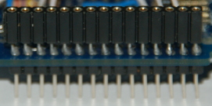

Die erste Platine war übrigens eine normale Platine mit 2,54mm Lochraster, deren Größe ich auf die eines Arduino zugeschnitten hatte. Nachteil ist, daß man das Lochraster für einen der Pin-Header auftrennen muß, weil die Arduinos an dieser Stelle eine "verschobene" Buchse haben. Deshalb ist es auf jeden Fall empfehlenswert, einen __Proto-Shield__ zu verwenden, bei dem die Löcher alle schon an der richtigen Stelle sind.

Nachfolgend sind __Schaltplan__, eine __"Breadboard"-Ansicht__ und der __fertig bestückte Protoshield__ zu sehen. Die Breadboard-Ansicht zeigt symbolisch auch die Sensoren am Mast, für deren Anbindung auf dem Proto-Shield ein gewinkelte Stiftleiste aufgelötet ist. Auf der Unterseite des Proto-Shield befindet sich eine Schiene (Draht) für +5V und eine Schiene für GND.

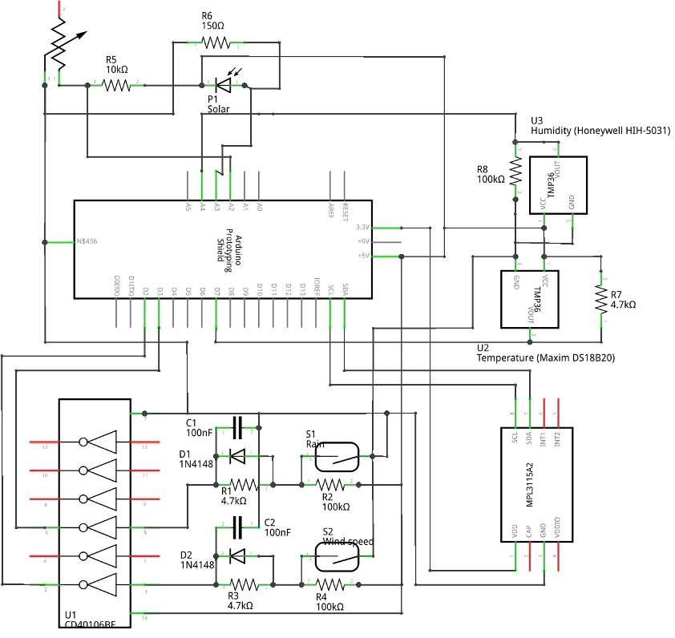
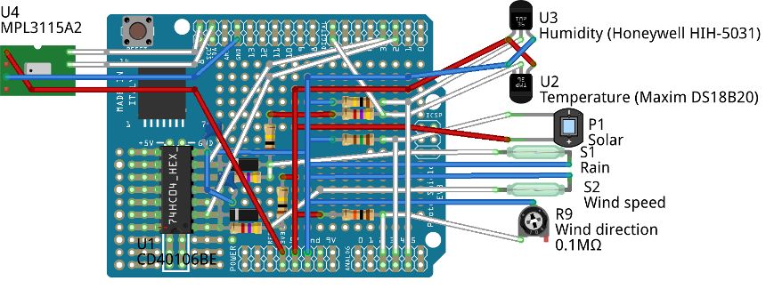

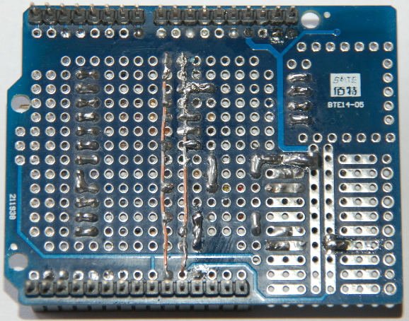

Einzeln für sich genommen ist die Schaltung für jeden Sensor relativ simpel mit einer Ausnahme: Das Zählen der Schalterschließungen bei Anemometer und Regenmesser war schwieriger als gedacht, da statt einer Kontaktschliessung oft scheinbar mehrere Kontaktschliessungen erkannt wurden. Zunächst habe ich versucht, das Problem softwaremäßig zu lösen, indem innerhalb einer bestimmten Zeit (z.B. 20 ms) nur eine Schließung zu berücksichtigt wird. Damit ist jedoch relativ viel Code in der Funktion, die vom Interrupt aufgerufen wird. Also habe ich versucht, daß Problem hardwaremäßig zu lösen durch einen Widerstand und einen Kondensator. Der Erfolg war mäßig. Erst die zuätzliche Verwendung eines __Schmitt-Triggers__ (das ist der einzige IC auf dem Proto-Shield - ein [CD40106BE](http://www.ti.com/lit/ds/symlink/cd40106b.pdf) von Texas Instruments) brachte den Durchbruch dahingehend, daß die Schalterschließungen korrekt gezählt wurden. Sehr hilfreich war dabei die Seite http://robotgestation.com/SensorForce.html (nicht mehr online, aber im [Internet-Archiv]( https://web.archive.org/web/20150607034250/http://robotgestation.com/SensorForce.html)), auf der die Hintergründe und verschiedenen Ansätze des Entprellens und auch der Schmitt-Trigger erläutert werden. Für einen 100nF-Kondensator (=0,0000001F) und einer Prelldauer von max. 10 ms (=0,01s) habe ich entsprechend der angebenen Formel den passenden Widerstand wie folgt berechnet:

```
Tc=Ladezeit des Kondensators in s
C=Kapazität des Kondensators in F
R=Widerstand in Ohm

Tc=C*R
R=Tc/C
R=0,01/0,0000001
R=100000 Ohm bzw. 100 kOhm
```

# Sketch

Für die Übertragung der [Sketch](arduino) auf den Arduino wird die [Arduino Software IDE](https://www.arduino.cc/en/Main/Software) benötigt.
Zusätzlich wird die oben erwähnte Bibliothek für den GSM-Shield sowie eine [Bibliothek für den Temperatur-Sensor](http://milesburton.com/index.php?title=Dallas_Temperature_Control_Library) benötigt.

Die Formel zu Berechnung der Relativen Luftfeuchtigkeit habe ich ermittelt, indem ich die beiden im [Datenblatt des Sensors](http://sensing.honeywell.com/index.php?ci_id=49692) angegebenen Formeln ineinander eingesetzt habe:
```
aus dem Datenblatt:

Vout = Vsupply * (0,00636 * SensorRH + 0,1515)

umstellen nach SensorRH:

SensorRH = (Vout / Vsupply - 0,1515) / 0,00636

aus dem Datenblatt:

TrueRH = SensorRH / (1,0546 - 0,00216 * Temp)

einsetzen der nach SensorRH umgestellten Formel:

TrueRH = ((Vout / Vsupply - 0,1515) / 0,00636) / (0,10545 - 0,00216 * Temp)

wobei Vout/Vsupply ersetzt werden kann analogRead()/1023:

TrueRH = ((analogRead() / 1023 - 0,1515) / 0,00636) / (0,10545 - 0,00216 * Temp)
```

Die Sketch nutzt den __Watchdog Timer__ des Atmel Mikrocontrollers, um den Arduino zu restarten, falls die Software einmal "hängen" bleiben sollte.

# Solare Stromversorgung

Bis zum Bau dieser Wetterstation hatte ich keinerlei Erfahrungen mit der Verwendung von Solarpanels. Wenn man sich etwas mit dem Thema beschäftigt, wird man jedoch schnell mit verschiedenen Volt- und Wattzahlen konfrontiert. Und dann ist da noch die Batterie, die durch das Solarpanel aufgeladen werden und die Wetterstation mit Strom versorgen soll.
Als Antwort auf die Frage nach der Voltzahl scheint __12V__ eine sinnvolle Größe zu sein: Es gibt eine große Auswahl an Batterien und sie kann direkt zur Stromversorgung des Arduino verwendet werden. Die Wattzahl des Solarpanels wird nur unter idealen Bedingungen erreicht und sollte auch bei suboptimalen Bedingungen ausreichen, die Batterie zu laden. Deren Kapazität sollte wiederum ausreichen, selbst ohne Nachladen durch das Solarpanel einige Zeit die Wetterstation mit Strom zu versorgen. Wie lange das ist, hängt vom Stromverbrauch der Wetterstation ab, der maßgeblich durch den GSM-Shield beeinflußt wird, wie nachfolgende Grafik des gemessenen Stromverbrauchs zeigt:

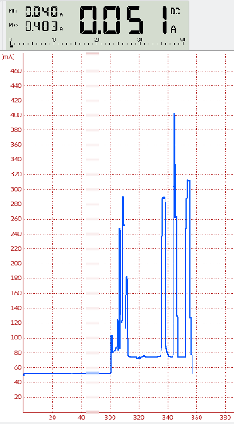

Wenn der GSM-Shield nicht aktiv ist, beträgt die Stromstärke 0,051A. Für jede Datenübertragung ist der GSM-Shield ca. 50 Sekunden aktiv. In dieser Zeit kann die Stromstärke bis zu 0,403A betragen. Im Mittel beträgt sie auch in dieser Zeit allerdings nur 0,121A.
Für den Stromverbrauch je Stunde ergibt sich damit:

```
GSM-Shield inaktiv: 3000s * 0,051A = 153,0 As
GSM-Shield aktiv  :  600s * 0,121A =  72,6 As
-------------------------------------------------
Summe                                    225,6 As = 0,063 Ah
```

Die von mir verwendete, wartungsfreie 18Ah-Batterie kann damit also die Wetterstation 285 Stunden bzw. knapp 12 Tage ohne Nachladen durch das Solarpanel mit Strom versorgen. Möglicherweise ist das etwas überdimensioniert ...
Damit die Batterie ausreichend geladen wird, habe ich mich für ein 20W-Solarpanel entschieden. Einen __Bausatz bestehend aus Solarpanel, Laderegler und Verbindungskabel__ habe ich von [Wattstunde](http://wattstunde.de) gekauft. Zur Montage des Solarpanels benötigt man noch eine __Solarmodul-Halterung__, die man entweder bauen oder kaufen kann.

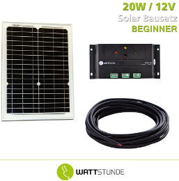
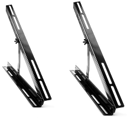

# Die Montage der Wetterstation

Der Arduino mit den Shields ist als zusätzlicher Schutz in einer __Kunststoffdose mit Schraubverschluß__ untergebracht. Diese ist durchsichtig, damit man die __GSM-Schield-LEDs__ trotzdem sehen kann. Die Kabel wurden einzeln durch Löscher im Deckel in in die Dose geführt, deren Größe passend zu den verwendeten __Gummi-Kabeldurchführungen__ ist. Innerhalb der Gummi-Kabeldurchführungen wurde das Kabel mit Heißkleber (5-Minuten-Epoxy würde genauso gehen) fixiert und abgedichtet. Ziel ist es, daß einzelne Sensorbaugruppen mit Kabel zu Test-/Ersatzzwecken ausgebaut werden können.

Die Kunststoffdose ist zusammen mit dem __Laderegeler__ und der __Batterie__ in einem __Schaltschrank__ untergebracht. Der Laderegler wurde auf ein Stück Hartschaumplatte aufgeschraubt, damit man dessen LEDs gut erkennen kann. Die grüne LED in der Mitte signalisiert, daß (trotz des trüben Wetters!) gerade geladen wird. Der Bogen für die oberen LEDs  signalisiert den Batteriezustand (rot<25%, gelb 25-75%, grün>75% des Bereichs zwischen Vollladung und Unterspannungsabschaltung). 

Der Schaltschrank selbst ist an dem __Container__ mit der Flugplatzausrüstung montiert. An seiner Seite ist der Mast der Wetterstation mit Schraubschellen montiert.
Auf dem Dach des Containers wurde die __Solarpanelhalterung__ festgeschraubt mit Ausrichtung des Panels nach __Süden__ und einer __Panelneigung von 30 Grad__. Außerdem befindet sich die __GSM-Antenne__ mit Magnetfuß auf dem Dach des Containers.


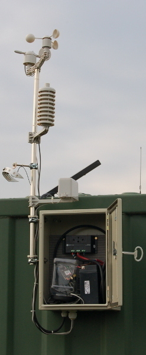
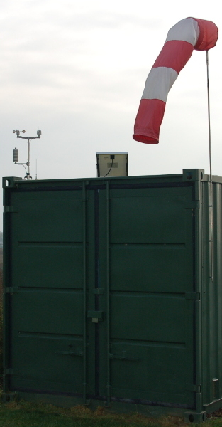
